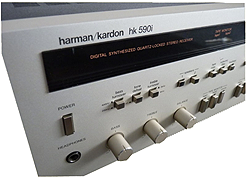

# Harman Kardon
Harman Kardon hk 590i

Replicating the functionality of the 1982 <b>Harman Kardon hk 590i</b> radio receiver.

Hit the power button and watch as this receiver comes to life!

What exactly did I do here?

I reverse engineered my own 1982 Harman Kardon 590i receiver as a Google Chrome experiment, utilizing technologies like <i><b>Less, JavaScript, HTML5, Google Web Fonts, streaming audio</b></i>, and the <i><b>JavaScript Web Audio API</b></i> to replicate the real-life receiver's functionality.

The interface is constructed almost entirely in CSS and HTML5, and matched as closely as possible to the real thing. A very small css sprite image was used to create the digital font in the electronic display. Go ahead, have a look at the source code! 

As mentioned, this is a Google Chrome experiment. Due to patent issues, the formats of the streaming audio sources will not work in the Firefox browser.
 

Speaking of the streaming audio sources... those are real live readio stations that you are hearing as you scan through the channels in AM or FM mode.

Hear something you like? Go ahead and save it as a preset by hitting the memory button, and then selecting a preset button.

Is it all about that bass? Then turn up that bass dial! Set the treble and balance where you would like it.

The bass/treble and tone defeat functions allow you to customize your sound, or bypass the bass and treble dials altogether

Speaking of the streaming audio sources... those are real live readio stations that you are hearing as you scan through the channels in AM or FM mode.

Hear something you like? Go ahead and save it as a preset by hitting the memory button, and then selecting a preset button.

Is it all about that bass? Then turn the bass dial up. Set the treble and balance where you would like it.

The bass/treble and tone defeat functions allow you to customize your sound, or bypass the bass and treble dials altogether

#DEMO

Try out the demo here: http://www.aceroinc.ca/harmanKardon
